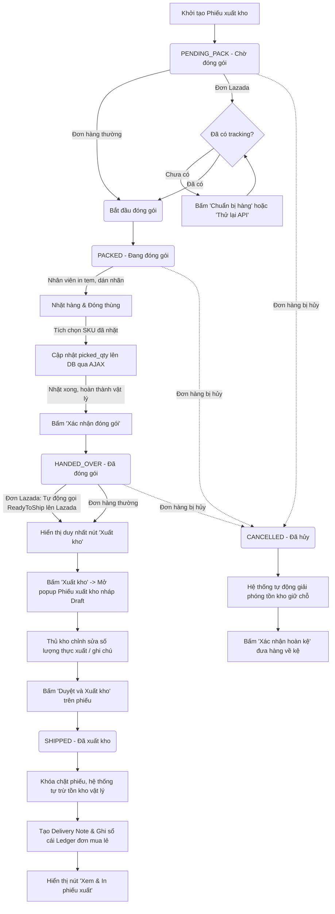

# Hướng Dẫn Nghiệp Vụ Luồng Xuất Kho (Outbound Flow)

Tài liệu này mô tả chi tiết luồng nghiệp vụ xuất kho (Outbound) dành cho nhân viên kho (**Warehouse Staff**) trên hệ thống OmniCore WMS Hub.

---

## 📌 Các Component Phụ Trách
*   **Giao diện:** [warehouse-outbound.jsp](file:///d:/omnicore-main/src/main/webapp/WEB-INF/views/outbound/warehouse-outbound.jsp)
*   **Controller:** [WarehouseOutboundServlet](file:///d:/omnicore-main/src/main/java/com/wms/controller/warehouse/WarehouseOutboundServlet.java)
*   **Service xuất kho chung:** [OutboundService](file:///d:/omnicore-main/src/main/java/com/wms/service/warehouse/OutboundService.java)
*   **Service điều phối đơn Lazada:** [LazadaOrderProcessingService](file:///d:/omnicore-main/src/main/java/com/wms/service/lazada/LazadaOrderProcessingService.java) và [LazadaShipmentService](file:///d:/omnicore-main/src/main/java/com/wms/service/lazada/LazadaShipmentService.java)

---

## 🗺️ Quy Trình Vòng Đời Phiếu Xuất (Outbound Lifecycle)

---

## 📑 Các Giai Đoạn Chi Tiết

### 1. Khởi tạo Phiếu xuất kho (Outbound Creation)
*   **Tự động:** Khi Sales Staff duyệt một đơn hàng (Order) hợp lệ, hệ thống gọi `autoCreateFromOrder` trong [OutboundService](file:///d:/omnicore-main/src/main/java/com/wms/service/warehouse/OutboundService.java#L411). Hệ thống tạo phiếu xuất kho `OutboundOrder` mới ở trạng thái `PENDING_PACK` và tạm giữ chỗ tồn kho (soft-allocate) qua `inventoryDAO.softAllocateInventory`.
*   **Thủ công:** Warehouse Staff có thể bấm **"Tạo phiếu xuất"** trên giao diện [warehouse-outbound.jsp](file:///d:/omnicore-main/src/main/webapp/WEB-INF/views/outbound/warehouse-outbound.jsp#L146) để chọn từ danh sách các yêu cầu bàn giao xuất kho (`FulfillmentRequest`) của Sales chuyển xuống. Khi xác nhận, [WarehouseOutboundServlet](file:///d:/omnicore-main/src/main/java/com/wms/controller/warehouse/WarehouseOutboundServlet.java#L178) xử lý `action=create` để tạo phiếu.

---

### 2. Quản lý Trạng thái Phiếu xuất (Tabs Bộ lọc)

#### A. Trạng thái `PENDING_PACK` (Chờ đóng gói)
*   **Đơn hàng Lazada:**
    *   Nếu đơn chưa được cấp mã vận đơn từ Lazada (chưa có `tracking_number`), giao diện hiển thị nút **"Chuẩn bị hàng"** (hoặc **"Thử lại API"** màu đỏ nếu bị lỗi). Khi bấm, hệ thống gọi API Lazada thông qua [LazadaPackServlet](file:///d:/omnicore-main/src/main/java/com/wms/controller/lazada/LazadaPackServlet.java) để thực hiện đóng gói ảo và nhận `package_id` cùng `tracking_number` về lưu vào database.
    *   Nếu đơn đã có mã vận đơn, giao diện hiển thị nút **"Bắt đầu đóng gói"**.
*   **Đơn hàng thường / bán lẻ:**
    *   Hiển thị trực tiếp nút **"Bắt đầu đóng gói"**. 
    *   Khi nhân viên kho bấm nút này, hệ thống cập nhật trạng thái phiếu xuất sang `PACKED` và ghi nhận nhân viên phụ trách thông qua `outboundDAO.assignPicker` và `outboundDAO.createPickingSheet`.

#### B. Trạng thái `PACKED` (Đang đóng gói)
*   **Giao diện:**
    *   Nút **"In tem Lazada"** (hoặc in lại tem): Luôn sáng để nhân viên click tải nhãn dán bất cứ lúc nào.
    *   Nút **"Xác nhận đóng gói"**: Mặc định bị khóa (Disabled) và mờ đi. Nút này chỉ tự động mở khóa sau khi đã bấm in tem ít nhất một lần thành công.
*   **Hành động vật lý:**
    *   Nhân viên mang tem đi nhặt hàng thực tế dựa trên **Vị trí kho** hiển thị trên giao diện.
    *   Mỗi lần nhặt được một SKU nào, nhân viên tích chọn checkbox tương ứng trên màn hình. Hành động này kích hoạt AJAX gọi đến `handleTogglePickItem` của [WarehouseOutboundServlet](file:///d:/omnicore-main/src/main/java/com/wms/controller/warehouse/WarehouseOutboundServlet.java#L407) để đồng bộ số lượng nhặt (`picked_qty`) vào DB ngay lập tức.
    *   Sau khi nhặt và đóng thùng vật lý xong, nhân viên quay lại màn hình bấm nút **"Xác nhận đóng gói"**. Hệ thống chuyển trạng thái phiếu sang `HANDED_OVER`.

#### C. Trạng thái `HANDED_OVER` (Đã đóng gói)
*   **Đơn hàng Lazada:** Hệ thống tự động gọi API `ReadyToShip` lên Lazada để báo cho sàn phát lệnh vận chuyển (Ready to Ship).
*   **Giao diện WMS:** 
    *   Đơn hàng chuyển sang tab **"Đã đóng gói"**.
    *   Tại dòng đơn hàng, chỉ hiển thị duy nhất nút bấm hành động **"Xuất kho"** (màu xanh dương).
    *   *Lưu ý:* Tuyệt đối chưa trừ tồn kho vật lý ở bước này.
*   **Luồng xuất kho nháp:** Khi shipper đến lấy hàng, thủ kho bấm **"Xuất kho"** để mở popup phiếu nháp (Draft), đối soát số lượng, chỉnh sửa thực tế hoặc điền thêm ghi chú. Sau đó bấm **"Duyệt và Xuất kho"** ngay trên phiếu.

#### D. Trạng thái `SHIPPED` (Đã xuất kho)
*   **Kích hoạt:** Chỉ khi thủ kho bấm nút **"Duyệt và Xuất kho"** trực tiếp trên phiếu ở Bước 3. Hệ thống vận hành theo trách nhiệm con người, không tự động đồng bộ qua Webhook cho bước giảm kho này.
*   **Hệ thống thực hiện:**
    1.  Khóa chặt phiếu xuất kho thành chứng từ chính thức.
    2.  Khấu trừ số lượng tồn kho vật lý thực tế (`qty_on_hand`) và giải phóng lượng tồn kho giữ chỗ ảo (`qty_reserved`) tương ứng trong database thông qua `inventoryDAO.deductShippedInventory(...)`.
    3.  Tạo tài liệu bàn giao (`Delivery Note`) và đồng bộ trạng thái đơn hàng Sales ban đầu thành `SHIPPED`.
    4.  *(Với đơn bán lẻ Omnichannel)*: Tự động phê duyệt bút toán và ghi nhận chứng từ sổ cái liên quan thông qua `LedgerDAO.approveDocument(...)`.
*   **Giao diện:** Đơn hàng chuyển sang tab **"Đã xuất kho"** và hiển thị nút bấm **"Xem & In phiếu xuất"** (màu xanh dương) để thủ kho có thể in lại chứng từ bất kỳ lúc nào.

#### E. Luồng Đơn bị hủy (`CANCELLED`)
*   Nếu đơn bị hủy từ phía sàn hoặc phía Sales, trạng thái phiếu xuất tự động đồng bộ sang `CANCELLED`.
*   Giải phóng lượng giữ chỗ tạm thời (`inventoryDAO.releaseSoftAllocateInventory(...)`).
*   Giao diện hiển thị nút **"Xác nhận hoàn kệ"** cho phép nhân viên xác nhận đã đưa hàng từ bàn đóng gói trở lại các kệ trong kho.

---

## 🗑️ Luồng Xuất Hủy hàng lỗi (Disposal / Scrap Flow)
Dành cho trường hợp hàng hóa bị hư hỏng trong quá trình lưu trữ tại kho:
1.  Nhân viên kho bấm nút **"Tạo Phiếu Xuất Hủy"** trên thanh công cụ.
2.  Nhập SKU sản phẩm lỗi, chọn số lượng, lý do hỏng và **tải lên hình ảnh bằng chứng**.
3.  Bấm **"Trình quản lý duyệt"** để lưu phiếu dưới dạng nháp (`DRAFT - Chưa duyệt`). 
4.  **Chú ý:** Ở trạng thái `DRAFT`, hệ thống **chưa trừ tồn kho thực tế**. Tồn kho chỉ được khấu trừ sau khi có phê duyệt chính thức từ **Business Manager (BM)**.
